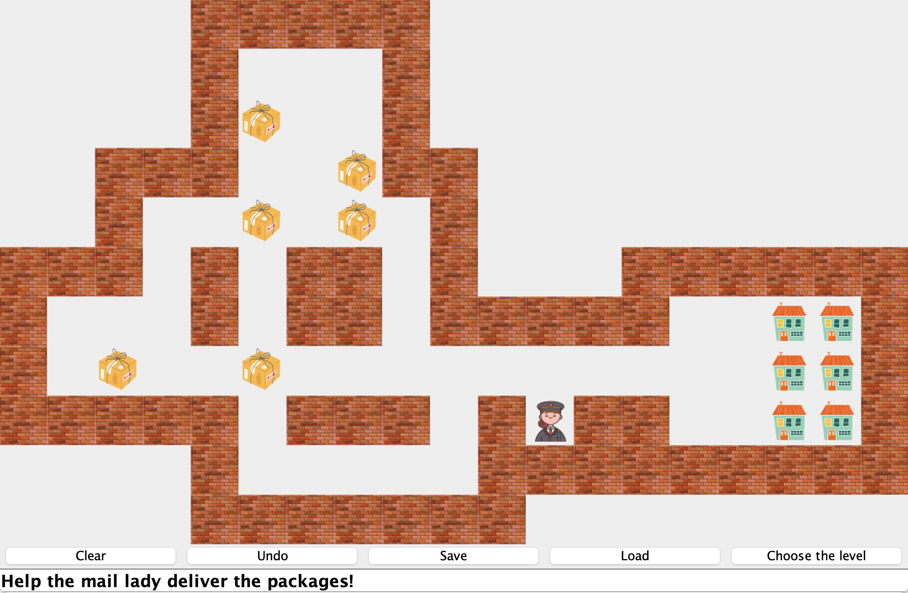

# Sokoban Game Implementation

This project is a Java-based implementation of the classic Sokoban game. The goal is to help the mail lady deliver packages by pushing them to the correct locations. The game features a graphical user interface that allows players to interact with the game in a fun and engaging way.

## Key Features

- **Undo/Redo Functionality:** Players can undo and redo their moves to strategize effectively.
- **Save/Load Game:** The game state can be saved and loaded, allowing players to continue their game later.
- **Multiple Levels:** Players can choose different levels, each with increasing difficulty.

## Files

- **PanelCell.class:** Handles the individual cells in the game grid.
- **SokobanPanel.class:** Manages the game board, rendering, and interactions.
- **SokobanUI.class:** The main user interface for the game.

## Object-Oriented Programming

The game is designed using object-oriented programming principles, emphasizing modularity and reusability. Below is an illustration of the key components and their interactions.

